# Icytomine v1.0.4 - Integrating Cytomine into ICY

>[!Warning]  
> 
>Originally created by Daniel Felipe González Obando, this plugin has been updated by Théo Hardy to support the latest versions of Cytomine ([Community Edition](https://github.com/cytomine/Cytomine-community-edition)) and Icy ([2.5.4.0](https://icy.bioimageanalysis.org)).The goal is to enable a seamless integration of Cytomine within Icy. Status (August 2025): under development.

Icytomine is a set of plugin that allows _Cytomine_ users to interact with their account directly from _ICY_. Users can access Cytomine from Icy using the Graphical Interface or from a command line. In the following sections plugins in Icytomine are described. Also, instructions on how to configure the development environment are included.

### 1. Introduction

Icytomine tries to integrate two technologies, one handling large images and the other performing image analysis.

On one hand, Cytomine is a server based software that provides a solution to store and handle annotations on large medical and biological images. At the moment of writing Cytomine supports only 2D images.

On the other hand, Icy is a client-side software specialized in image analysis for biological images. It can perform heavy image processing techniques but can only work in images of limited size.

The idea of integrating these two technologies was started back in 2015 by developing a simple prototype comprising a connection and image transferring plugin. This effort was extended in 2016 when a primitive viewer was introduced alongside with some protocols to retrieve images from Cytomine servers as Sequences in Icy. This current release takes those works and creates from the ground a set of plugins that offer users the possibility to interact with Cytomine servers directly on Icy in the following ways.

* Supporting multiple active connections to different servers.
* Allowing for image and project exploration and search with a user-friendly interface.
* An easy-to-use viewer is available to view Annotations and images at different resolutions.
* Import/Export of image between Icy and Cytomine, enabling image processing results to be stored on servers.
* Different protocols have been developed in order to enable unattended processing and batch processing of annotations, images and projects.

### 2. Using Icytomine

#### 2.1. Opening the Icytomine Explorer

The explorer is the main plugin of Icytomine. It allows users to view available projects and images, as well as opening the viewer to explore annotations inside each image.

To open the explorer type `Icytomine` on the plugin search bar in Icy and select the plugin called *Icytomine Explorer*. 

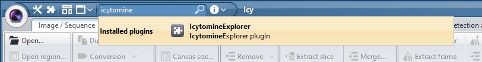

The connection dialog will appear to allow the user to register his credentials and perform the connection to the server.

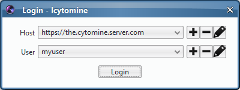

#### 2.2. Adding a Cytomine Server connection to Icytomine

##### 2.2.1. Adding a server

Once on the connection dialog, the user can add multiple credentials to connect to multiple servers. In order to add a new credential click on the  button at the end of the Host row to add a new server. Then fill in the server url field on the popup frame and the click the *Add host* button.

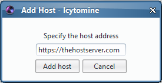

The created server will now be available on the dropdown menu of hosts. If by any reason you need to change the server address, click on the  button. If you want to remove a server from the available servers, then click on the  button and confirm the deletion. For now just go ahead and select the server you just created.

##### 2.2.2. Adding a user

Now you will need to add a new user for that server. Click on the  button at the end of the User row to add a new user on the selected server.

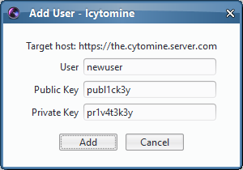

Fill in the user details and click the *Add* button. The credentials just created will now appear as an option on the connection dialog. If you want to cancel the user creation click the *Cancel* button to go back to the connection dialog. If by any reason you need to change the server address, click on the  button. If you want to remove a server from the available servers, then click on the  button and confirm the deletion.

##### 2.2.3. Connecting to a Cytomine server

Once you have a user account setup for the target server, you can connect to it by selecting the target server and user to establish the connection. Then click the *Login* button.

If the connection is successful the Explorer panel will appear. Otherwise, check your connection credentials and adjust them appropriately.

#### 2.3. Using the Icytomine Explorer

When the connection to a Cytomine server is successful the following interface will appear:

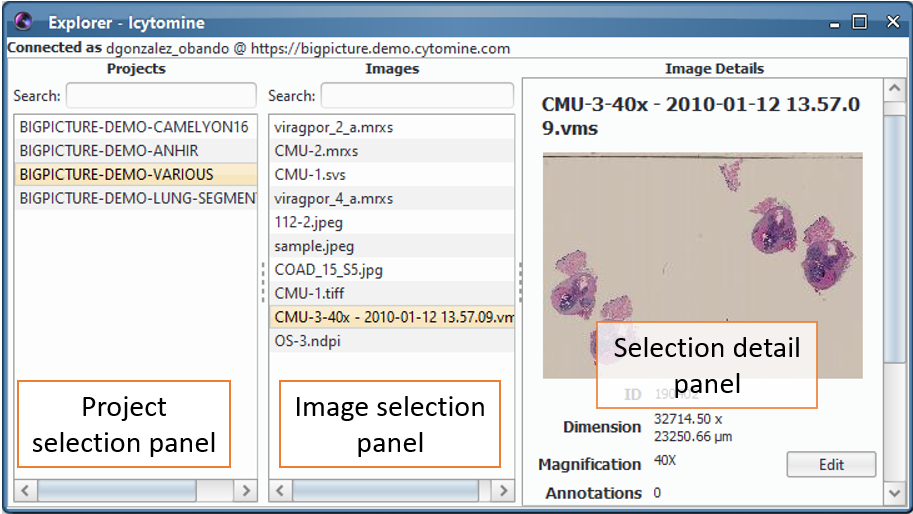

At the top of the frame the target server and user are displayed (useful when connecting to multiple servers).

##### 2.3.1. Window structure

The explorer is divided in three main panels (columns). The left most panel presents available projects. The central panel shows available images for a selected project. Finally, the rightmost panel presents details on the last selected item (either a project or an image).

##### 2.3.2. Searching projects

The projects panel allows users to see the list of projects available for the current user as well as to search for a project by its name or identifier. To do this, the user just has to type on the search bar on top of the projects panel. The search criterion can be partial. In other words, the user does not have to type the full name or identifier of the project. The list will progressively filter available projects to keep only those who respect the search criterion.

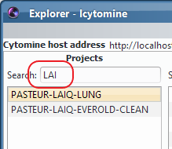

When a project is selected, two things happen. First, the list of available images for the selected project will be displayed on the images panel. And second, the details of the project will be displayed on the details panel.

##### 2.3.3. Searching images

Once a project is selected, the user can choose an image from the list of available images for the that project. In addition, users can search images by their name or their identifier. To do this, the user just has to type on the search bar on top of the images panel. The search criterion can be partial. In other words, the user does not have to type the full name or identifier of the image. The list will progressively filter available images to keep only those who respect the search criterion.

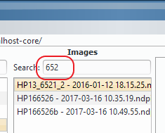

When an image is selected the details of the image will be displayed on the details panel.

##### 2.3.4. Setting up image magnification and pixel resolution

The user can adapt  the magnification and the pixel resolution values of a selected image if and only if the user is the uploader of the image in the server. To do this the user has to click the *Edit* button on the details panel on the desired property, then type the new value, followed by clicking the *Save* button. The details will be updated afterwards.

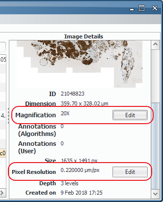

#### 2.4. Using the Image Viewer

When the user double clicks an image in the image selection panel or the preview image, an image viewer of the selected image will popup.

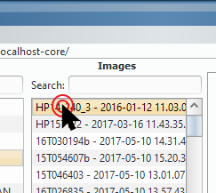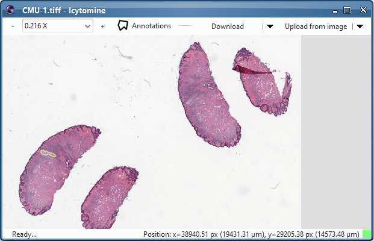

The viewer can be divided into three horizontal parts:

1. The action bar: All available actions are displayed in the top of the viewer frame. They will be described later in this section.
2. The viewport: The visualization of the selected image. The view is adjusted when the viewport moved or zoomed in/out. It also displays the enabled annotations for the image.
3. The status bar: Located at the bottom, the status bar holds information about the information transfer between the user and host machines. It also presents the cursor position on the image in both pixel and metric units.

##### 2.4.1. Visualizing an image

The image viewer is a useful tool to inspect images on the server and explore the existing annotations associated to it. In it you can move around using your mouse.

###### 2.4.1.1 Move around the image

To move the view, just place the cursor on the image and drag the mouse with the left button pressed moving to the direction you want.

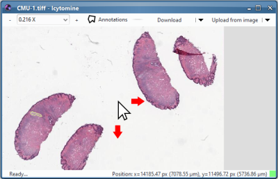

###### 2.4.1.2. Adjusting the zoom of the image view

To zoom-in on the viewer, place the cursor at the target position and then scroll-up with the mouse scrolling wheel. Conversely, to zoom-out just scroll-down with the mouse.

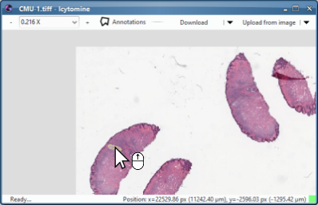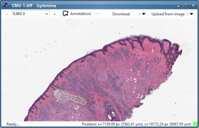

###### 2.4.1.3. Exploring annotations on the image

The Icytomine viewer is enabled to show annotations made by users having access to the image. You can select which annotations you want to be shown and filter them by user or associated term. To take control of which annotations are seen, you have to open the Annotations inspector by clicking the *Annotations* button.

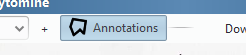

This will make the annotations inspector to show up. The annotation inspector shows a list of the available annotations on the image, presenting details about their name (their identifier), associated terms, the author user, and the type of annotation (User or Algorithm annotation).

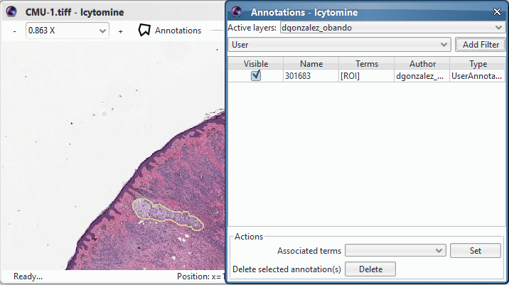

###### 2.4.1.4. Filtering annotation by layers

As you can see in the image above, when you first open an image the only active layer is the one of the currently logged user. In the case of this example there is only one annotation in the image associated to this user, and it is both visible on the image (i.e. the beige outline), and in the annotation list. 

Lets add more layers! To do this click the drop down menu of the *Active layers*.

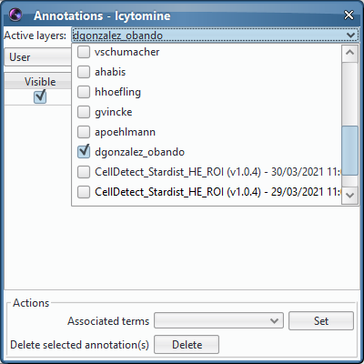

Every layer you select will download and make visible all annotations associated to it. Layers are associated to users and to job results made by running algorithms on the server. The following example show the selection of a job result layer.

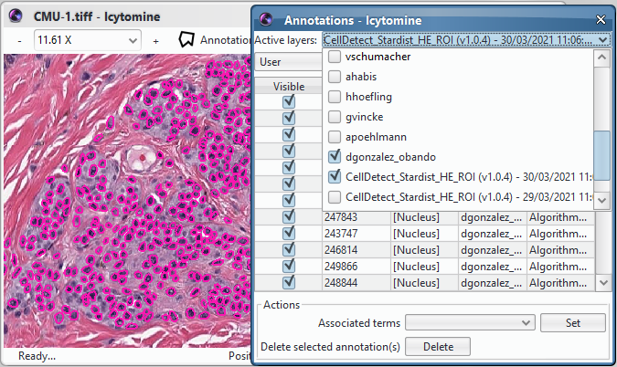

###### 2.4.1.5. Filtering visible annotations

You can filter the annotations shown in the list by adding filters. Currently, you can filter results by user or by term. To add a filter, select the filter type from the drop down menu next to the *Add Filter* button and then press the *Add Filter* button.

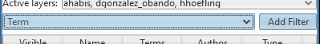

When clicked a row will be added above the annotation list. You will be able to select which terms you want to be visible and those that should be hidden.

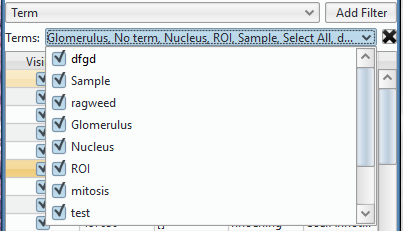

You can also hide/show annotations individually by clicking the check box associated to the target annotation on the *Visible* column.

After selecting the annotations you want to see, you will be able to select them from either the viewer or the annotation inspector. When you select and double click an annotation on the image, it will automatically be selected in the annotation list. Conversely, if you select and double click an annotation on the list, the view will move to the selected annotation.

You can also select multiple annotations by holding the *Shift* key while creating a rectangle in the image by drag and drop the mouse. Annotations intersecting the rectangle will be selected. To individually de/select annotation hold the *Ctrl* key while clicking the annotation you want to de/select.

###### 2.4.2.6. Associating terms to annotations

You can edit the term association on the selected annotations by selecting the terms to be de/activated on the *Actions* panel. 

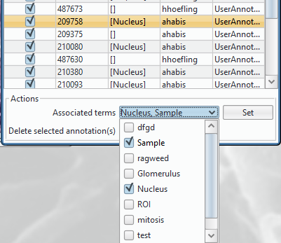

Then click the Set button to commit your changes on the server. After the changes are sent to the server, the list will be updated.

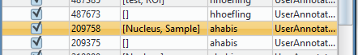

###### 2.4.2.7. Deleting annotations

You can delete annotations from Icytomine by selecting the annotation/s and click the *Delete* button in the *Actions* panel. You will need to confirm the deletion before the annotation is actually deleted. **Warning**: Deleting an annotation locally will also delete the annotation in the server and will make this operation irreversible.

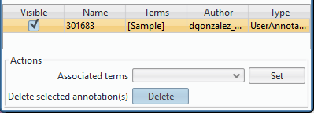

##### 2.4.2. Transferring images

With Icytomine you can both import and export annotations from an to a Cytomine server. Annotations are imported into Icy sequences as ROIs (**R**egions **O**f **I**nterest) with internal properties set to associate them to the annotations in the server.

###### 2.4.2.1. Transferring images from Cytomine to Icy

To import annotations from a Cytomine server into Icy select in the viewer the portion of the image you want to import into Icy. Then click the *Download* button in the action bar of the viewer.

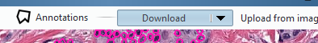

Next, you will be able to setup the size of the downloaded image by setting the *Magnification* of the downloaded view. This will have an impact on the quality of the result image and will adjust the pixel size of the downloaded image. You can choose one of the preconfigured magnifications or you can set it manually by clicking the *Manual* checkbox. Every time you change the magnification is changed, the *Output* size will display the result image size so that you can be aware of the image size.

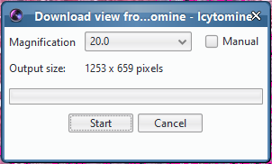

Once the magnification is set, click the *Start* button to launch the image download. It might take some time to download the image but at the end a sequence with the downloaded view should be displayed. The sequence will include the annotations that were visible in the viewer at the moment of downloading the image. As you can see in the *ROI inspector* on the right of the workspace, downloaded Cytomine annotations are now Icy ROIs. You can activate the column *Annotation Terms* to see the associated terms for each downloaded ROI.

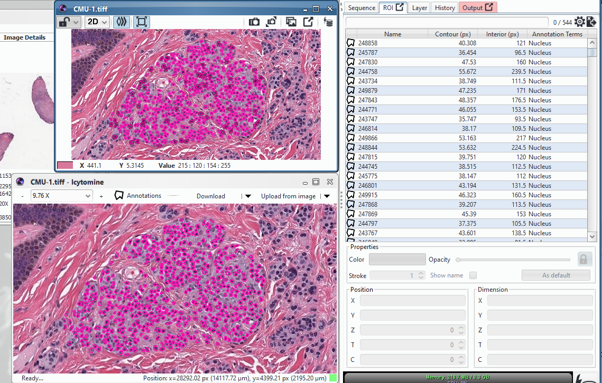

###### 2.4.2.2. Transferring annotations on an open sequence to Icytomine

With downloaded views you can also create new ROIs and send them to a Cytomine server. Let's see how to do this.

First, you need to create in Icy the ROIs you want to send to the server. In the following example I created a simple polygon (in green) to circle an object in the image.

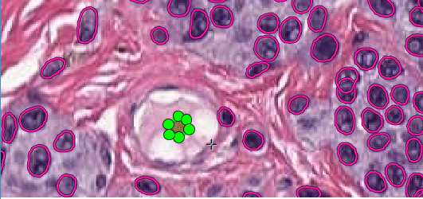

Next, click the *Upload from image* button in the action bar of the Icytomine viewer.

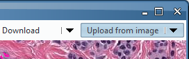

This will make the upload form visible to select the *target sequence* you want to take ROIs from. You can choose to only upload selected ROIs by activating the *Send only selected ROIs* checkbox. When the setup is finished, click the *Send* button to start the ROI upload.

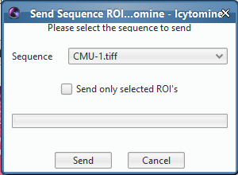

When uploading ROIs, Icytomine will only upload ROIs that have changed in comparison to the server. In this case all ROIs remain the same as in the server, except by the one I created. Only this ROI will actually be sent to the server.

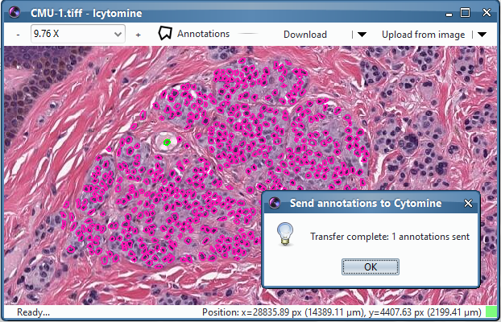

The result of uploading ROIs is a confirmation dialog indicating the number of annotations uploaded. The view is immediately updated to include all the new annotations.

###### 2.4.2.3. Transferring annotations on an image file to Icytomine

In some situations users might be interested in saving the downloaded view in the local machine, annotate it offline, and eventually send the new annotations back to the server. This is possible in Icytomine by performing the same procedure as in [Transferring annotations on an open sequence to Icytomine](#2422-transferring-annotations-on-an-open-sequence-to-Icytomine) with the difference that on the action bar we select the *Upload from image* option.

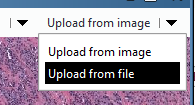

Next, you will need to specify the image file you want to use to send ROIs from. This will use Icy image importer to read the existing ROIs in the file and send them to the Cytomine server.

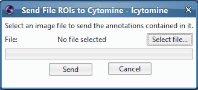

### 3. Automating Icytomine using protocols

Icy comes bundled with the possibility of creating protocols that automate certain tasks like processing multiple files in batch or divide a big image into smaller tiles and do some specific process on each tile. Using the same principle, Icytomine provides the functionalities to retrieve projects, images and annotations filtered under multiple criteria. In this section these functions are explained.

To start using Icytomine in protocols you first have to open the protocols plugin by searching for it on Icy's search bar.

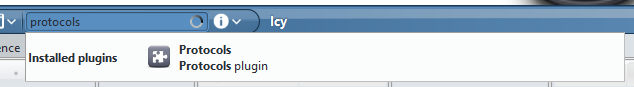

When the protocols plugin opens you will see the protocol workspace with a new blank protocol open.

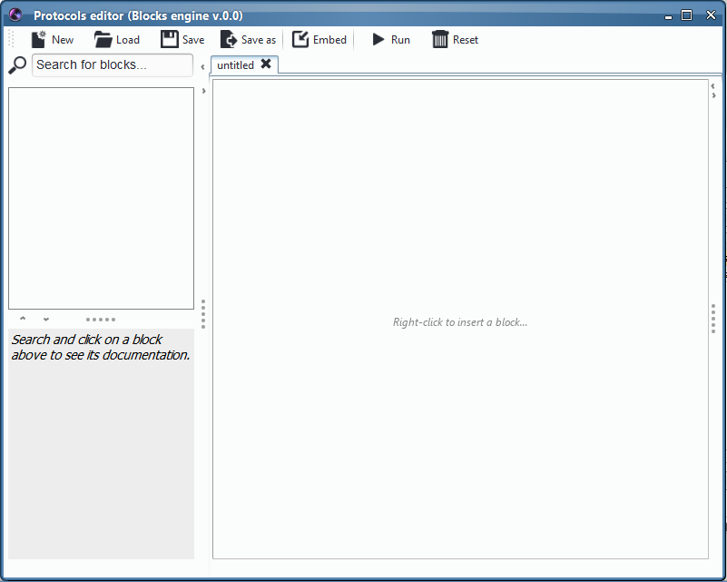

Here you can start adding blocks and connecting them to create your custom made protocols. Let's see some of the blocks provided by Icytomine

#### 3.1. Login in to the server

The first step to use Icytomine is to connect to the server. To achieve this, you should add the ***Create cytomine** client* block. Search for it in the protocols search bar and drag and drop it into the empty protocol. You will need to fill in the server login details in the protocol

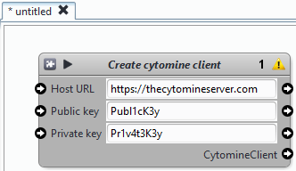

You can test the connection by adding a ***Display*** block and launching (using the *Run* button at the top) the protocol execution. If the protocol run correctly the result in the Display block should present the connection details. Otherwise, an error will be presented in the output log (It will show the message "`CytomineClienException: User credentials not recognized`"). 

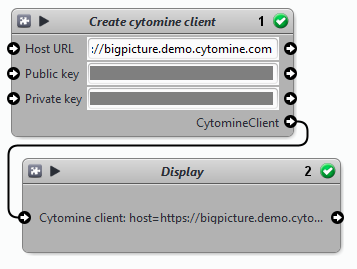

The next blocks will depend on this block to keep a reference to the Cytomine server.

#### 3.2. Getting access to a project

Use the ***Get cytomine project*** to recover the information of a specific project located by its identifier which can be found on Icytomine Explorer or directly into the Cytomine server website.

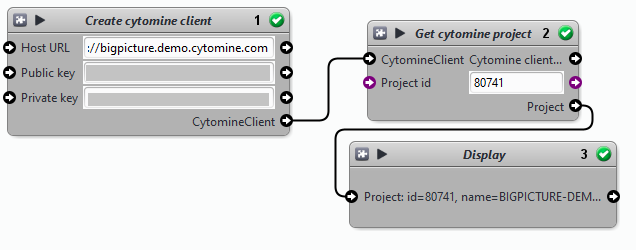

Similar to *Create cytomine connection*, the *Get cytomine project* block allows to keep a reference to a project on the server. From it you will be able to retrieve and loop through all the images in the project.

#### 3.3. Getting available images

##### 3.3.1. Looping through project images

You can retrieve all the images of a specific project using a loop block called ***Cytomine project loop***. It will loop through each the images in the parameter project and execute the blocks inside its workspace (display the image details in the example below).

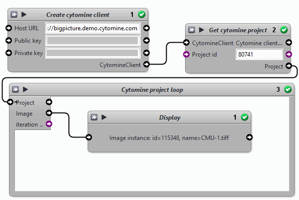

If you want you can download the image from the server and use it for your analyses by adding the ***Cytomine image loop***. It will take all the tiles of the image at a given resolution level (level $x$ means an image of $1/2^x$ the size of the original image), and loop to each tile. You can specify the size of the tile, the size of the margin, or even the area of the image you want to focus on. All this is specified using **Define rectangle1*** or ***2*** blocks for the target area, and the ***Define dimension*** block for the size and margin. In the example below I retrieve each full image of a project at $1/32^{th}$ their original size.

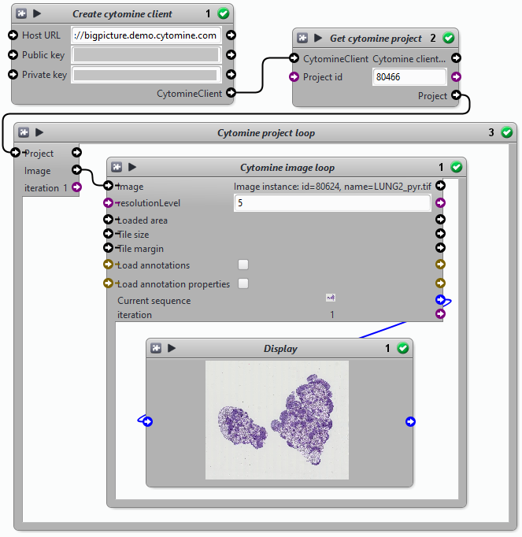

##### 3.3.2. Single image processing

In some cases you might want to focus on a single image to perform your analyses. In these cases, you can achieve this by creating a reference to the image in the server using the ***Get cytomine image*** block. It will create a reference to a single image that you will be able to use next with a *Cytomine image loop* or a block that takes an image reference as input.

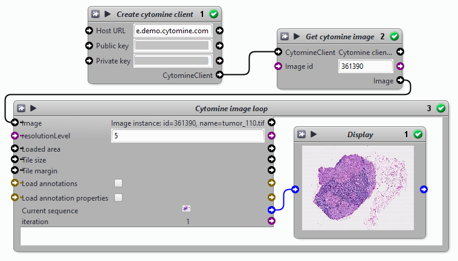

##### 3.3.3. Using image tiles

As I mentioned earlier, it is possible to download large images using tiles. In the case you want to use a specific tile size, you have to use the ***Define dimension*** block to specify the tile size to the image loop. The example below takes tiles of 256 pixels from the image at resolution level 8.

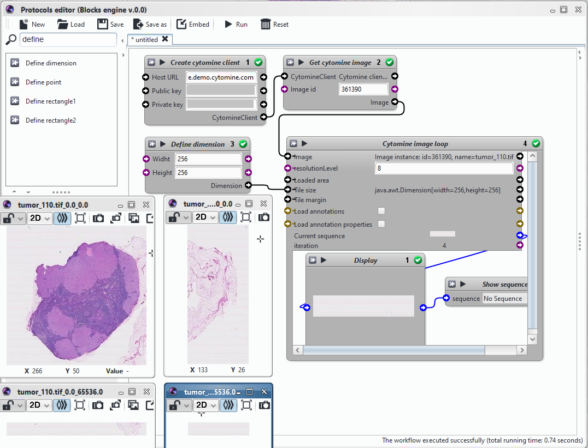

#### 3.4. Working with image annotations

Most of the times you will be interested in using the annotations stored on a Cytomine server to retrieve the images at specific areas.

##### 3.4.1. Retrieving image annotations

Icytomine provides a way to retrieve the annotations of an image by using the ***Get cytomine user annotations*** block for user annotations and the ***Get cytomine algorithm annotations*** block for annotations coming from server jobs. This blocks will retrieve a set of annotations that can then be used to recover the images at their location. Check the following example, I loop through each annotation of a specific user and download the annotation image at resolution level 1 and with a margin of 128 pixels.

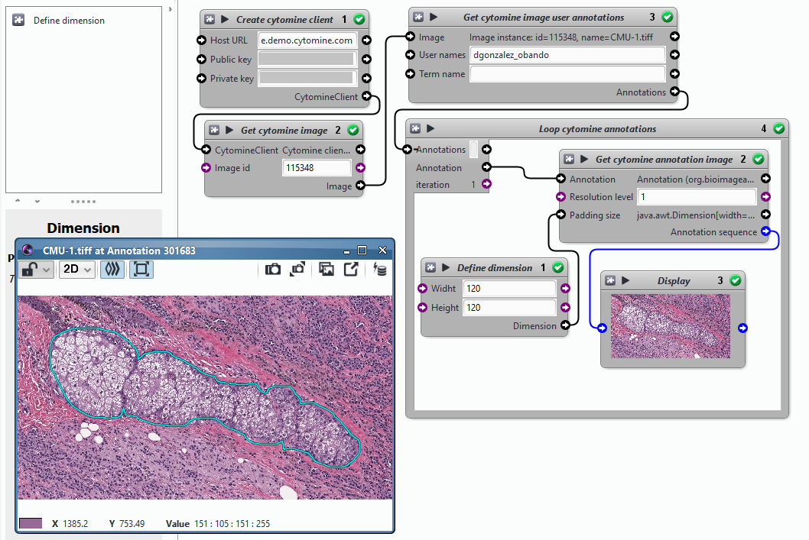

After downloading the annotations and the images you can perform analyses and send back to the server the annotations you want (For example, the results of a thresholding of the image).

##### 3.4.2. Getting available annotations inside another annotation

There are cases where you want to focus only on annotations located inside another annotation (For example, to measure the average size of the annotations of one type at the same position as another annotation of different type). To achieve this, you have to identify the containing annotation and then use the ***Get cytomine algorithm annotations in annotation*** block to retrieve the annotation inside. Alternatively, you can use the ***Get cytomine user annotations in annotation*** block to retrieve user annotations instead of algorithm ones.

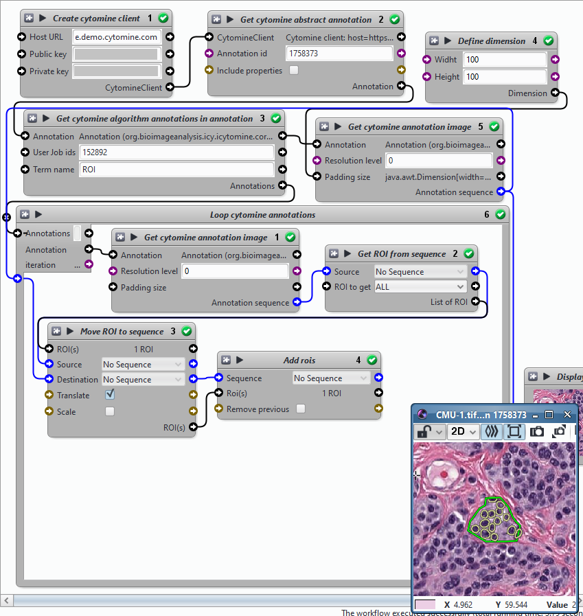

#### 3.5. Uploading Annotations to Cytomine

Using protocols also allows you to send annotations to a server, this can be done using the ***Send ROIs to Cytomine*** block. It takes the sequence containing the ROIs to send to the server, and the target image reference in the server. You can use this block in any of the loop blocks that have already been presented, it just needs the sequence and the reference to the server image.

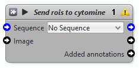

### Setting up a development environment

#### Requirements

* JDK: 8 or above
* Icy: 2.1 or above
* A Java IDE (e.g. Eclipse or IntelliJ IDEA)
* A Git Client (Or use the one integrated on the IDE)

#### Getting the code

You can use git to download the code from GitLab ([https://gitlab.pasteur.fr/bia/org.bioimageanalysis.icy.icytomine](https://gitlab.pasteur.fr/bia/org.bioimageanalysis.icy.icytomine)).

If you use Eclipse as your IDE you can download the code directly from the IDE by switching to the Git perspective and paste the link in the repository explorer.

#### Open the project into your IDE

Once the code is downloaded, you can open it using the Maven plugin on either Eclipse (Import > Maven > Existing Maven Project) or IntelliJ. You have to specify the directory containing the POM file that describes the project including dependencies and the packaging strategy.

#### Project organization

The project code is located at the *project* directory. Inside, you will find the src/main/java directory, which contains all the Icytomine packages:

- **`plugins.danyfel80`**:
  - **`cytomine`**: Contains all the protocol related block plugins of Icytomine
  - **`icytomine`**: Contains the Icytomine Explorer plugin (The plugin with user interface).
- **`org.bioimageanalysis.icy.icytomine`**:
  - **`core`**: Contains the logic of the plugins to communicate between Icy and Cytomine servers.
  - **`geom`**: Contains utility classes for performing geometrical operations.
  - **`ui`**: Contains the user interface code for all elements in the Icytomine Explorer.
- **`vars.cytomine`**: It provides the variables used by the protocol blocks to transfer Cytomine related information.

